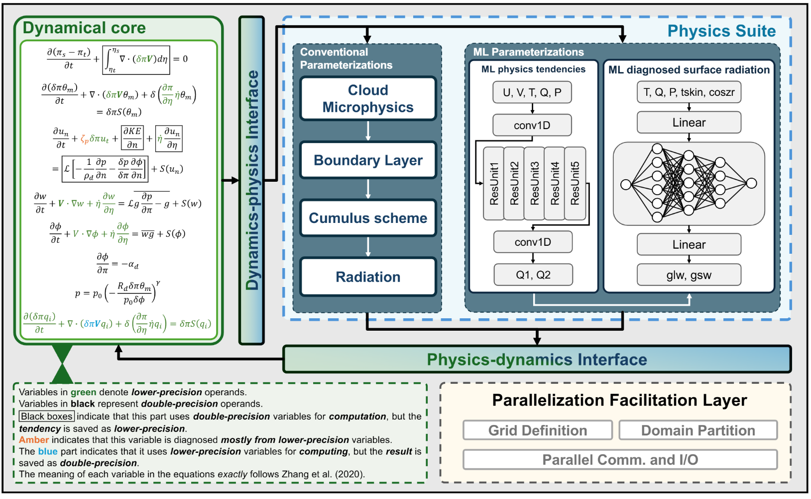

# SW-GRIST

In our work, we optimize GRIST model for the next-generation Sunway supercomputer, incorporating an ML-enhanced physics suite, OpenMP-based parallelization for SW26010P heterogeneous architecture, and mixed-precision code optimizations to improve both efficiency and performance portability. Our approach scales to 34 million cores, achieving 0.5 simulated-years-per-day (SYPD) for 1-km resolution atmospheric modeling scenarios, 1.34 SYPD for 3-km resolution, surpassing current state-of-the-art (SOTA) works. 

 

Figure illustrates the architecture of the GRIST AI-hybrid model, which comprises two primary components: the dynamical core and the physics suite. The dynamical core operates on a globally decomposed horizontal mesh and is numerically resolved. The physics suite includes the conventional parameterization modules, as well as an ML-based physics suite, which leverages multiscale interactions distilled from global storm-resolving simulations to improve the coarse-resolution hydrostatic-scale simulations, reduces computational demands and addresses the load balancing issues.

## SW26010 Pro 

The new generation of Sunway supercomputer system inherits and extends the Sunway TaihuLight architecture based on the new generation of Sunway (SW) high-performance heterogeneous many-core processors and interconnected network chips. Each node on the new generation of Sunway supercomputer system is equipped with a single SW processor (SW26010 Pro) that is subdivided into six core groups (CGs). Each CG contains a management processing element (MPE) and 64 computing processing elements (CPEs),


## GRIST
Global Storm Resolving Models (GSRMs) is crucial for understanding extreme weather events under the climate change
background. Global-Regional Integrated Forecast System (GRIST) is  a unified weather-climate Global Storm Resolving Model (GSRM)  system designed for research and operation. It includes many features:

1. A unified global dynamical core that can switch between hydrostatic and nonhydrostatic modes, coupled with a bespoke model framework suitable for general-purpose model development as well.  
2. Two physics suites (PhysW/AMIPW_Physics; PhysC/AMIPC_Physics) integrated with the dynamical core.  
3. Includes a 1D single-column model and a 2D shallow water model for testing physics and horizontal numerical operators, respectively.  
4. Extensively tested across various scenarios, including single-column mode, shallow-water mode, 3D dry/moist idealized dynamics, AMIP, NWP-style, and GSRM.  
5. Offers customized diagnostic templates tailored for specific applications (please refer to the GRIST tutorial for details).  

For more details, please refer to https://grist-tutorial.readthedocs.io/en/latest/.


## Dependency 

The softwares which are required on Sunway system are listed as follow:
* Compiler:
    + GNU Fortran (GCC) 7.1.0 20170502
    + swgcc (GCC) 7.1.0 20170502
* MPI:
    +  MPICH version 3.2b2
* NetCDF:
    + NetCDF 4.9.2
* OpenMP:
    + SWGOMP 0.2.0 

## Build


There are two kinds of software in this repo. GRIST is a original version on Sunway.  It can run directly on SW processors. GRIST-OPT is an optimized version with mixed-precision and  AI-enhanced physics suite. We provide step-by-step instrctions to build the GRIST model on Sunway system. 


### SWGOMP
To build GRIST on Sunway, we should first build SWGOMP on Sunway. 

``` shell
cd SWGOMP 
make
```

For more details about SWGOMP, please refer to https://gitee.com/swmore/swgomp. 


### GRIST


To compile the program on Sunway platform, we provide shell scripts which paths are *SW-GRIST/GRIST/bld* and *SW-GRIST/GRIST-OPT/bld*. 

The steps are listed as below:

Before building, you can use

``` shell
make clean
```

to clean up the previous compilation and recompile the source code of software.


Build MPE double-precision(MPE-DP) version: 

``` shell 
cd GRIST 
sh build-mpe-dp.sh
```

 Build MPE mixed-precision(MPE-MIXED) version: 


``` shell 
cd GRIST 
sh build-mpe-mixed.sh
```

Build CPE double-precision(CPE-DP) version:

``` shell 
cd GRIST-OPT
sh build-cpe-dp.sh
```

Build CPE mixed-precision(CPE-MIXED) version: 

``` shell
cd GRIST-OPT
sh build-cpe-mixed.sh
```


## RUN 

We also provide  shell scripts in *demo-g6-aqua* to run the program on Sunway platform.  The 100km (G6) data and the weight of AI-enhanced physics suite along with its corresponding parameter files are also provided in *demo-g6-aqua*. 

In the directory GRIST/demo-g6-aqua, there are run-*.sh to run different versions of GRIST. 

``` shell 

# run MPE-DP
sh run-mpe-dp.sh

# run MPE-MIXED
sh build-mpe-mixed.sh

# run CPE-DP
sh run-cpe-dp.sh

# run CPE-MIXED
sh run-cpe-mixed.sh

```


## Citation 


*An AI-Enhanced 1km-Resolution Seamless Global Weather and Climate Model to Achieve Year-Scale Simulation Speed using 34 Million Cores*, PPOPP 25


